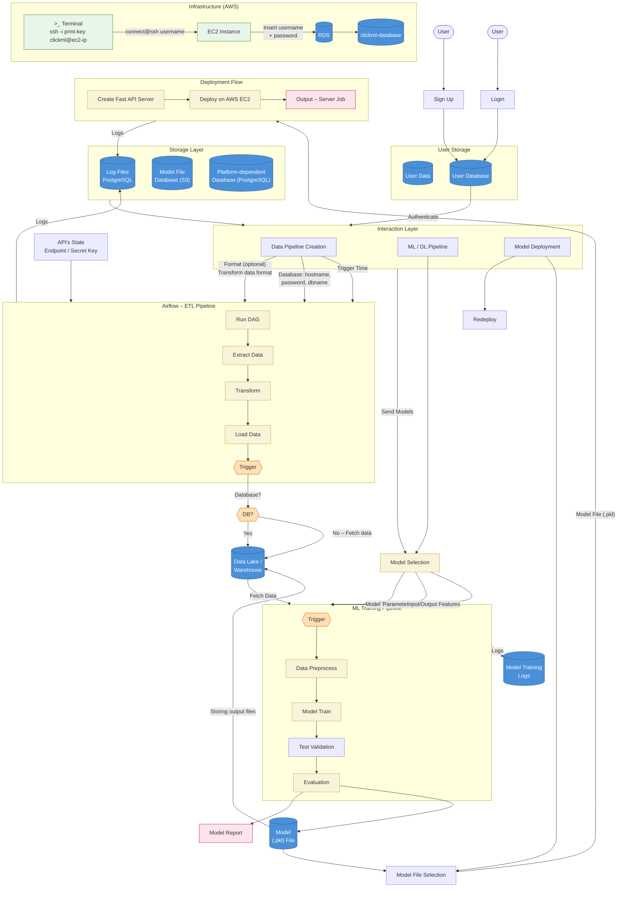

# ClickML
### End-to-End ML Lifecycle Platform

---

ClickML is a modular, full-stack MLOps platform that converts UI-based workflow actions into executable machine learning jobs. It manages the complete ML lifecycle — from data ingestion and preprocessing to pretraining, fine-tuning, quantization, registry tracking, and deployment. Designed for scalability, reproducibility, and hardware compatibility.

## Workflow in ClickML

---

## Table of Contents

- [System Architecture](#system-architecture)
- [Vision](#vision)
- [Objectives](#objectives)
- [Core Capabilities](#core-capabilities)
- [Example Workflow](#example-workflow-in-clickml)
- [Why ClickML Stands Out](#why-clickml-stands-out)
- [Future Roadmap](#future-roadmap)

# System Architecture

ClickML follows a modular microservice-style structure:

---
## Vision

ClickML simplifies complex ML engineering workflows into structured, traceable pipelines without sacrificing flexibility or control.

It is built for:
- ML Engineers
- AI Researchers
- Data Engineers
- Students building production-grade ML systems

---
# Objectives
- To allow users to create configurable ETL pipelines.
- To automate pipeline scheduling using Apache Airflow.
- To provide a no-code machine learning model creation interface.
- To store processed and raw data in the user’s database.
- To support model training for regression and classification problems.
- To generate pickle files and comprehensive model reports.
- To deploy ML models via API endpoints.
- To create a robust frontend for seamless user interaction.

# Core Capabilities

## Data Governance & ETL Engine
- Structured dataset ingestion
- Data version tracking
- Pipeline-based transformations
- Validation & schema enforcement
- Reproducible preprocessing jobs

- 
---
- 

## Model Training Engine

- Pretraining workflows
- Supports Multiple Models:
  - Linear Regression
  - Random Forest Regression
  - Decision Tree Regression
  - Random Forest Classification
  - Decision Tree Classification
- Hyperparameter configuration via UI
- Distributed training support (Docker-ready)
- Training logs & metrics tracking

## Deployment Layer
- FastAPI-based inference endpoints
- Containerized model serving
- Production-ready deployment structure

## Workflow Orchestration
- Airflow-integrated job scheduling
- Modular DAG execution
- Background task management
- Retry & failure handling

  

---

# Why ClickML Stands Out

- Full ML lifecycle coverage
- Built-in reproducibility
- UI → executable pipeline conversion
- Model lineage tracking
- Registry-driven deployment
- Modular & scalable architecture

# Future Roadmap

- RAG pipeline integration

- LLM fine-tuning modules

- Experiment tracking dashboard

- Kubernetes deployment support

- Multi-user workspace system
